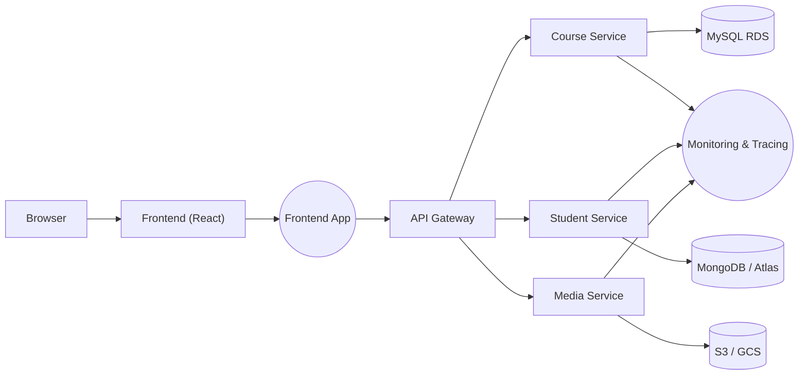

# 🚀 Enterprise Cloud Architecture - Practical Microservices & Multi-Cloud Patterns

> **Enterprise-Cloud-Architecture** - A hands-on, practical collection showing how to containerize, build, and deploy microservices across local Docker and cloud environments (AWS & GCP).
> Focus: Spring Boot backends, React frontend, MySQL & MongoDB, and media storage patterns (local → S3/GCS).

[](https://alive-lumber-714.notion.site/Enterprise-Cloud-Architecture-2369212713998038bd50ea842d2e577b?pvs=74)
[](https://youtu.be/3lRoZ-b2A04?si=INPWWWzBqWCAGDna)
[](https://youtu.be/0K7LpX-jrGY?si=rbc5xYc8Xp17ckkX)

---

## 🗂 Repository Overview

This repo contains two main, ready-to-play-with project suites:

### 1) `docker-intro-app` — Docker containerization hands-on

A practical, full-stack demo showing how to containerize a microservice system for local development:

* Spring Boot backends and a React frontend packaged for Docker.
* MySQL and MongoDB containerized (latest LTS images recommended).
* `docker-compose.yml` to orchestrate services for local development and tests.
* Updated backend configs to connect to containerized DBs.

### 2) `cloud-enabled-deployment-in-action-with-aws` — Cloud deployment patterns

An introductory multi-cloud deployment blueprint and configs:

* **course-service** (Spring Boot + MySQL) -  cloud deployment scaffolding for AWS & GCP.
* **student-service** (Spring Boot + MongoDB) - infra & deployment notes (AWS/GCP pending).
* **media-service** - local file storage now; instructions and code to integrate S3/MinIO.
* **frontend-app** - React + TypeScript build & cloud hosting patterns.
* Build scripts and sample deployment configs.

---

## 🔗 IMPORTANT NOTES & QUICK REFERENCES

* Full, **structured notes** on Enterprise Cloud Architecture (concepts, step-by-step guidance, diagrams):
  **Notion:**
  [https://alive-lumber-714.notion.site/Enterprise-Cloud-Architecture-2369212713998038bd50ea842d2e577b?pvs=74](https://alive-lumber-714.notion.site/Enterprise-Cloud-Architecture-2369212713998038bd50ea842d2e577b?pvs=74)

* Quick video walkthroughs:

  * **AWS RDS DB + endpoint creation (YouTube):**
    [https://youtu.be/3lRoZ-b2A04?si=INPWWWzBqWCAGDna](https://youtu.be/3lRoZ-b2A04?si=INPWWWzBqWCAGDna)
  * **GCP Cloud SQL (MySQL) instance creation (YouTube):**
    [https://youtu.be/0K7LpX-jrGY?si=rbc5xYc8Xp17ckkX](https://youtu.be/0K7LpX-jrGY?si=rbc5xYc8Xp17ckkX)

> ⭐ These links contain practical, fast demonstrations that complement the repo - watch them to speed up database provisioning and cloud connections.

---

## 📁 Repo Structure (High Level)

```
Enterprise-Cloud-Architecture/
├─ 01) docker-intro-app/
│  ├─ course-service/
│  ├─ student-service/
│  ├─ media-service/
│  ├─ frontend/
│  └─ docker-compose.yml
├─ 02) cloud-enabled-deployment-in-action-with-aws/
│  ├─ course-service/
│  ├─ student-service/
│  ├─ media-service/
│  ├─ frontend-app/
│  └─ deployment-configs/ (k8s / IaC / templates)
├─ LICENSE
└─ README.md (this file)
```

---

## ⚡ Quickstart — Run Locally with Docker Compose

**Prerequisites**: Docker & Docker Compose installed. (Java, Node optional for building locally)

```bash
# clone
git clone https://github.com/gayanukabulegoda/Enterprise-Cloud-Architecture.git
cd "01) docker-intro-app"

# see docker-compose.yml and .env.example
# start local environment
docker compose up --build
```

* Frontend: typically available at `http://localhost:3000`.
* Backend APIs: exposed per service (see each service README or `application.properties`).

Stop:

```bash
docker compose down --volumes
```

---

## ☁️ Cloud Deployment Guidance (High-Level)

### AWS (recommended quick routes)

* **Databases**: Use **RDS (MySQL)** for `course-service`. For MongoDB, consider **DocumentDB**, **MongoDB Atlas**, or self-managed on EKS.
* **Storage**: Use **S3** for `media-service`. Use IAM roles with least privilege + pre-signed URLs for client uploads.
* **Compute**: ECS Fargate (quick) or EKS (Kubernetes) for production. Frontend: S3 + CloudFront for static hosting.
* **Secrets**: Store credentials in Secrets Manager / Parameter Store.
* **Artifact registry**: ECR for Docker images.
* **CI/CD**: GitHub Actions → build → push → deploy (ECS/EKS/Terraform).

### GCP (equivalent patterns)

* **Cloud SQL** for MySQL, **GCS** for object storage, **Cloud Run** (serverless) or **GKE** for containers.
* Use **Secret Manager**, **Artifact Registry**, and **Cloud Build** or GitHub Actions for CI.

---

## 🛠 Recommended CI/CD & Infra Stack

* **CI**: GitHub Actions to build Java and React artifacts, build Docker images, run tests, and push images.
* **CD**: GitHub Actions + Terraform or CloudFormation. Use ECR/GCR, ECS/Cloud Run/EKS/GKE.
* **IaC**: Terraform modules for VPC, DB, IAM, and compute resources.
* **Observability**: CloudWatch / Stackdriver + Prometheus / Grafana / X-Ray / Jaeger.

---

## ✅ Migration & Production Checklist

* Externalize configuration to env vars and secrets manager.
* Replace local file storage with S3/GCS (media-service).
* Migrate local DB to managed DB (RDS / Cloud SQL) with backups & multi-AZ.
* Add liveness/readiness checks (for K8s).
* Add centralized logs, monitoring & tracing.
* Harden networking (VPCs, private subnets, security groups).
* Automate infra with IaC and GitOps (ArgoCD).

---

## 🧭 Architecture



---

## 📦 What’s Next / Roadmap

* Add Terraform modules for AWS & GCP (RDS/Cloud SQL, VPC, ECR/GCR, ECS/EKS/GKE).
* Provide sample GitHub Actions workflows (CI + CD).
* Add Helm charts for Kubernetes deployments.
* Add production-grade observability & security examples (Prometheus + Grafana, ELK).
* Automate an end-to-end demo that provisions minimal infra, deploys services, and tears down.

---

## 🤝 Contributing

Contributions welcome! Please:

* Open issues for bugs / feature requests.
* Use `pull requests` with clear descriptions.
* Never commit secrets — use `.env.example` for sample variables.

Security disclosure contact: **[grbulegoda@gmail.com](mailto:grbulegoda@gmail.com)**

---

## 📜 License

This repository is provided under the license in the root `LICENSE` file. (Please check that file for terms.)

---

<p align="center">
  💡 If you find this project useful, consider giving it a ⭐ on GitHub!
</p>
<p align="center">
  🚀 Thank you for visiting! Stay connected & keep innovating! 🎉
</p>
<p align="center">
  &copy; 2025 <strong>Gayanuka Bulegoda</strong>
</p>

---
